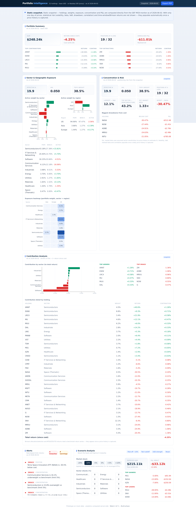

# Portfolio Intelligence Dashboard

An internal web app that ingests a fund's **holdings, prices, and benchmark** and
shows, on one screen, **what the portfolio holds, how much risk it carries, and
what drove performance** — replacing the manual spreadsheet assembly of those
views.

This is a 3-week prototype on mock data, built as a **production-track
foundation**: the analytics layer is fully separated from presentation so it can
graduate to formal use without a rewrite.


P1 stretch features (alert feed + scenario analysis):



---

## Architecture

```
 Mock CSVs            FastAPI + pandas/numpy              React + Vite + TS
 holdings ─┐          ┌───────────────────────┐          ┌──────────────────┐
 prices   ─┼─ load ─▶ │ validate → FX→USD →    │ ─JSON──▶ │ shell + 4 sections│
 benchmark ┤  & flag  │ compute metrics → serve│   REST   │ charts & tables   │
 fx       ─┘          └───────────────────────┘          └──────────────────┘
        (the only layer        all fund math lives        renders only — holds
         touching raw data)    here · validated ±0.1%     no fund math
```

**The frontend never computes fund math. The backend never handles
presentation.** Every cross-holding total is normalised to USD before
aggregation; malformed rows are skipped and flagged, never crash the app.

- **Backend** — Python · FastAPI · pandas/numpy. REST endpoints `/summary`,
  `/exposure`, `/risk`, `/attribution` (P0), plus `/alerts` and `/scenario`
  (P1), plus `/meta` and `/health`.
- **Frontend** — React · TypeScript · Vite · Tailwind · Recharts. A single-screen
  dashboard with a global window selector (MTD/QTD/YTD/1Y/All) and one-click
  PDF export.

See [`docs/workflow-map.md`](docs/workflow-map.md) for the foundation workflow map.

---

## Repository layout

```
backend/
  app/
    config.py             constants (base ccy, risk-free, trading days)
    data/loader.py        load + validate + USD-normalise (the data-swap point)
    analytics/            presentation-free fund math
      windows.py          MTD/QTD/YTD/1Y/ALL resolution
      summary.py          AUM, P&L, returns, contributors
      exposure.py         weights, active weights, HHI, heatmap
      risk.py             vol, beta, Sharpe, VaR, correlation, drawdown
      attribution.py      period returns, contribution, Brinson
      alerts.py           rule-based limit checks (P1)
      scenario.py         shock-and-reprice engine (P1)
      snapshot.py         snapshot-native analytics (static one-day data)
    models/schemas.py     window enum
    main.py               FastAPI app + endpoints (routes to snapshot mode)
    mock_data/            the app's four CSVs (generated by a script below)
  data/GEF_MCB_Monitor.csv   the boss's real portfolio snapshot (source)
  scripts/ingest_portfolio.py  GEF snapshot -> the four CSVs
  scripts/generate_mock_data.py  synthetic daily history (optional demo)
  tests/test_analytics.py validation vs independent reference
frontend/
  src/
    api/client.ts         typed fetch client
    types/api.ts          TS mirror of the JSON contract
    lib/                  formatting + fetch hook
    components/           shell, cards, matrix, ui states
    sections/             the four P0 sections
    App.tsx
docs/
```

---

## Running it

Prerequisites: Python 3.11+, Node 20+.

```bash
# 1. Backend  (http://localhost:8000)
cd backend
python3 -m venv .venv && source .venv/bin/activate
pip install -r requirements.txt
python scripts/generate_mock_data.py      # writes app/mock_data/*.csv
uvicorn app.main:app --reload

# 2. Frontend (http://localhost:5173) — in a second terminal
cd frontend
npm install
npm run dev
```

The Vite dev server proxies `/api` → `http://localhost:8000`, so the app works
with no CORS setup. Open http://localhost:5173.

Or use the shortcuts:

```bash
make setup     # install backend + frontend deps, generate data
make backend   # run the API
make frontend  # run the dev server
make test      # backend validation tests
```

---

## Data

The live dataset is the **GEF MCB portfolio monitor** — a real static daily
snapshot (32 positions, as of 6/2/2026). `scripts/ingest_portfolio.py` reads
`data/GEF_MCB_Monitor.csv` and writes the app's four CSVs. Headline figures tie
out exactly to the sheet (AUM $248,236, P&L −$11,008 / −4.25%).

**Snapshot mode.** With only one day of prices, the time-series metrics
(volatility, beta, VaR, drawdown, correlation, MTD/QTD/YTD/1Y and Brinson
returns) cannot be computed from real data, so the backend automatically
switches to **snapshot-native** analytics (`app/analytics/snapshot.py`):
return-since-cost, contribution by security/sector, concentration & positioning
risk, concentration/position alerts, and a stress test using *assumed* sector
sensitivities. Exposure (weights, active weights vs the **Nasdaq-100 proxy**
benchmark, sector/region, heatmap) is fully supported. The UI flags the mode and
which panels populate once a price history is captured (the loader detects
`is_snapshot` automatically when more than one date is present).

**Synthetic demo (optional).** `scripts/generate_mock_data.py` produces ~7.5
months of seeded daily history for a tech universe — used to exercise the full
time-series analytics (vol/beta/VaR/Brinson) when a history exists.

To go live, replace the four CSVs (or point the loader at a feed) — **nothing in
the analytics or frontend changes**, and the time-series panels light up on their
own once history accrues.

---

## Validation

`backend/tests/test_analytics.py` recomputes key metrics with an independent
numpy/pandas path and asserts they match within ±0.1%, plus checks the Brinson
reconciliation identity (allocation + selection + interaction = active return).

```bash
cd backend && source .venv/bin/activate && pytest -q
```

---

## Scope

- **P0 (shipped):** Portfolio Summary, Sector & Geographic Exposure, Risk
  Metrics, Performance Attribution.
- **P1 (shipped):** rule-based alert feed, scenario shock-and-reprice,
  one-click PDF export (print).
- **Out of scope (production phase):** live custodian/brokerage feeds, trading,
  multi-user auth/persistence, intraday streaming.

## Notes / decisions

- **Frontend = React + Vite** (not Next.js): a single-screen dashboard with all
  computation in FastAPI doesn't need SSR/routing; a Vite SPA keeps the
  frontend/backend split clean and the initial load fast.
- VaR is reported as a positive 1-day loss fraction, both historical and
  parametric. 1Y on the mock set is flagged as truncated (history starts in Nov).
