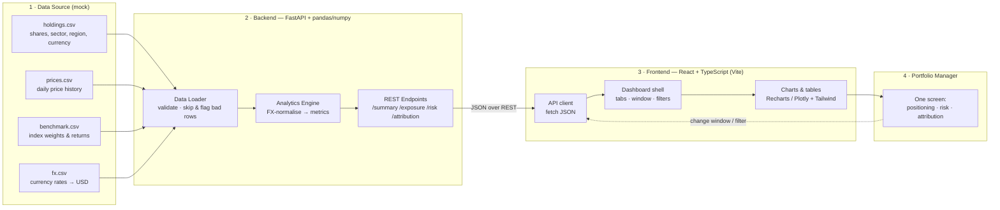
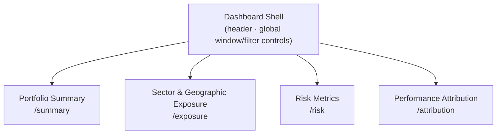

# Portfolio Intelligence Dashboard — Foundation Workflow Map

**Author:** Folahan Williams (Investment Analyst Intern) · Funds Management & Technology
**Date:** Thursday, 18 June
**Stage:** Week 1 — Foundation
**Purpose:** Show, on one page, how the system is wired end to end — how data flows, where it is fetched, what the backend computes, what the frontend renders, and what the Portfolio Manager actually sees on screen.

---

## 1. One-line picture

> A fund's **holdings, prices, and benchmark** go in. A single screen comes out showing **what we hold, how much risk we carry, and what drove performance** — computed once on the server, rendered instantly on the client.

The guiding rule, which everything below enforces:

> **The frontend never computes fund math. The backend never handles presentation.**

This separation is the load-bearing decision: the analytics layer is built so it can graduate to production use without a rewrite.

---

## 2. The workflow at a glance



**Read it left to right:** mock files → backend loads & validates → analytics engine computes all fund math → thin REST endpoints serve JSON → frontend fetches and renders → manager sees one screen. When the manager changes the date window or a filter, the request loops back to the backend (dotted line) and the screen recomputes in under half a second.

---

## 3. Where the data is fetched

For the prototype, **all data is local mock files** loaded by the backend — no database, no external dependencies, runs on a laptop or the internal server.

| Input | Holds | Used for |
|---|---|---|
| `holdings.csv` | shares, sector, region, native currency per security | AUM, weights, exposure |
| `prices.csv` | daily price history (from November last year onward) | returns, volatility, beta, VaR, drawdown |
| `benchmark.csv` | index sector/region weights and returns (S&P tech basket) | active weights, Brinson attribution |
| `fx.csv` | currency rates to USD | currency-normalising every cross-holding total |

**Currency:** every holding is normalised to **USD** before any total is aggregated — this happens once, inside the backend, before metrics are computed.

**Production path (out of scope now, designed for later):** the loader is the *only* place that touches raw data. Swapping mock CSVs for live custodian / market-data feeds (e.g. Finnhub) is a change to that one layer — the analytics engine and frontend are untouched.

---

## 4. The backend — where the thinking happens

**Stack:** Python · FastAPI · pandas / numpy

Three stages, in order:

1. **Load & validate** — read the mock files, check each row. Malformed or missing rows are **skipped and flagged**, never crash the app (graceful degradation).
2. **Analytics engine** — FX-normalise, then compute every metric from the formulas (AUM, weights, active weights, volatility, beta, Sharpe, VaR 95/99, max drawdown, contribution, Brinson allocation vs selection). Each metric is validated against an independent reference to within ±0.1%.
3. **Serve** — four thin REST endpoints return ready-to-render JSON. No calculation logic lives anywhere else.

| Endpoint | Powers the screen section | Returns |
|---|---|---|
| `GET /summary` | Portfolio Summary | AUM, P&L, total & active return, top contributors/detractors |
| `GET /exposure` | Sector & Geographic Exposure | sector/region weights, signed active weights, HHI / effective N, heatmap data |
| `GET /risk` | Risk Metrics | volatility, beta, Sharpe, VaR (95/99, historical & parametric), correlation matrix, max drawdown |
| `GET /attribution` | Performance Attribution | MTD/QTD/YTD/1Y returns, contribution by security & sector, Brinson alloc vs selection |

---

## 5. The frontend — what gets rendered

**Stack:** React · TypeScript · Vite · Tailwind · Recharts / Plotly

The frontend is a **pure presentation layer**. It fetches JSON from the four endpoints and renders it. It holds no fund math — only display state (which tab is open, which date window, which filters).



Each section maps one-to-one to one backend endpoint, so the data path for any view is obvious and traceable.

---

## 6. What the user sees (UI / UX)

The Portfolio Manager opens **one screen** and gets the three core answers in seconds — no scrolling needed for the primary insights.

```
┌──────────────────────────────────────────────────────────────────────────┐
│  PORTFOLIO INTELLIGENCE          [ Window: 1M ▾ ]  [ Filter: All ▾ ]       │
├──────────────────────────────────────────────────────────────────────────┤
│  AUM (USD)        Total Return       Active vs Benchmark                    │
│  $XX.Xm           +X.X%              +X.X%                                  │  ← Portfolio Summary
│  Top contributors:  ▲ AAPL  ▲ MSFT     Top detractors:  ▼ NVDA  ▼ AMD       │
├───────────────────────────────────────┬──────────────────────────────────┤
│  SECTOR & GEOGRAPHIC EXPOSURE          │  RISK METRICS                      │
│  ┌──────────────┐                      │  Volatility   Beta   Sharpe        │
│  │ exposure     │  active weights      │  XX.X%        X.XX    X.XX          │
│  │ heatmap      │  (signed vs bench)   │  VaR 95% / 99%     Max Drawdown     │
│  └──────────────┘  HHI / effective N   │  correlation heatmap               │
├───────────────────────────────────────┴──────────────────────────────────┤
│  PERFORMANCE ATTRIBUTION                                                     │
│  MTD  QTD  YTD  1Y    |   Contribution by sector/security                    │
│  Brinson: allocation vs selection by sector                                 │
└──────────────────────────────────────────────────────────────────────────┘
```

**Interaction model:**
- The manager changes the **window** (MTD / QTD / YTD / 1Y) or a **filter** (sector / region) once, at the top.
- Every panel below **recomputes from the backend in under 500 ms** — positioning, risk, and attribution all update together against the same window.
- **Empty and error states are explicit:** if data is missing or a row was flagged, the panel says so clearly rather than showing a blank or a wrong number.

**Experience targets (from the PRD):**

| What the manager experiences | Target |
|---|---|
| Time to the three core answers | < 30 s from load |
| Initial load (mock data) | < 2 s |
| Recompute on window/filter change | < 500 ms |
| Metric accuracy vs independent reference | within ±0.1% |

---

## 7. Why it's built this way (the foundation point)

This is a 3-week prototype on mock data, but it is built as a **production-track foundation**:

- **Analytics separated from presentation** → the fund math lifts into production unchanged.
- **One loader owns all data access** → mock CSVs swap for live feeds in a single place.
- **Thin, typed REST contract** → frontend and backend evolve independently.
- **Graceful degradation + ±0.1% validation** → trustworthy enough to graduate to formal use without a rewrite.

---

## 8. Week 1 status (Foundation)

| Item | State |
|---|---|
| Stack & data confirmed | Done |
| Workflow / foundation map | Done (this document) |
| Data pipeline (load -> validate -> normalise) | In progress |
| Dashboard shell | In progress |
| Portfolio Summary working end to end | Next |

**Next:** stand up the pipeline + shell, deliver the working Portfolio Summary, and begin AI sector research — leading into Week 2 (Exposure, Risk, Attribution).
